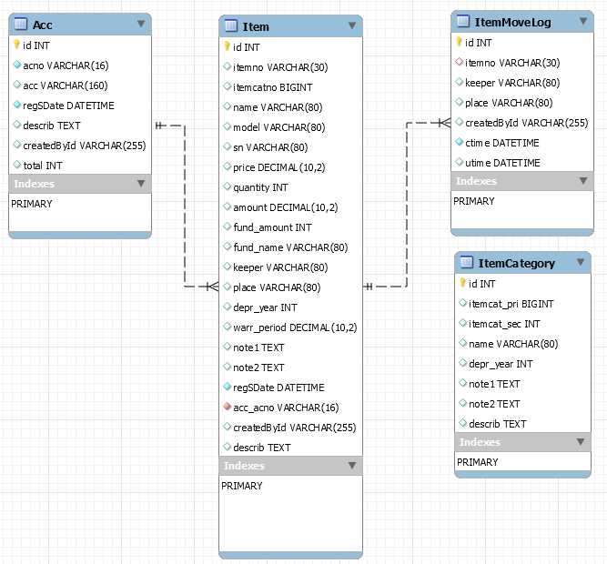

# EsAsset

##
python main.py --help

init db   
python main.py --initdb   

run    
python main.py   

## ER




## SQL

```sql
CREATE TABLE IF NOT EXISTS Acc (
        id INTEGER NOT NULL,
        acno VARCHAR(16) NOT NULL,
        acc VARCHAR(160),
        regSDate DATETIME NOT NULL,
        describ TEXT,
        createdById VARCHAR(255),
        total INTEGER,
        PRIMARY KEY (id),
        UNIQUE (acno)
);
CREATE TABLE IF NOT EXISTS ItemCategory (
        id INTEGER NOT NULL,
        itemcat_pri BIGINT,
        itemcat_sec INTEGER,
        name VARCHAR(80),
        depr_year INTEGER,
        note1 TEXT,
        note2 TEXT,
        describ TEXT,
        PRIMARY KEY (id)
);
CREATE TABLE IF NOT EXISTS Item (
        id INTEGER NOT NULL,
        itemno VARCHAR(30),
        itemcatno BIGINT,
        name VARCHAR(80),
        model VARCHAR(80),
        sn VARCHAR(80),
        price NUMERIC(10, 2),
        quantity INTEGER,
        amount NUMERIC(10, 2),
        fund_amount INTEGER,
        fund_name VARCHAR(80),
        keeper VARCHAR(80),
        place VARCHAR(80),
        depr_year INTEGER,
        warr_period NUMERIC(10, 2),
        note1 TEXT,
        note2 TEXT,
        regSDate DATETIME NOT NULL,
        acc_acno VARCHAR(16) NOT NULL,
        createdById VARCHAR(255),
        describ TEXT,
        PRIMARY KEY (id),
        UNIQUE (itemno),
        UNIQUE (itemcatno),
        FOREIGN KEY(acc_acno) REFERENCES Acc (acno)
);
CREATE TABLE IF NOT EXISTS ItemMoveLog (
        id INTEGER NOT NULL,
        itemno VARCHAR(30),
        keeper VARCHAR(80),
        place VARCHAR(80),
        createdById VARCHAR(255),
        ctime DATETIME NOT NULL,
        utime DATETIME,
        PRIMARY KEY (id),
        FOREIGN KEY(itemno) REFERENCES Item (itemno)
);
```

## ORM

```python
from datetime import datetime
from flask import Flask
from sqlalchemy.sql.elements import between
from flask_sqlalchemy import SQLAlchemy
from sqlalchemy import desc

builtin_list = list

#db = SQLAlchemy()
from intWeb import db

def init_app(app):
    # Disable track modifications, as it unnecessarily uses memory.
    app.config.setdefault('SQLALCHEMY_TRACK_MODIFICATIONS', False)
    db.init_app(app)

def from_sql(row):
    """Translates a SQLAlchemy model instance into a dictionary"""
    data = row.__dict__.copy()
    data['id'] = row.id
    data.pop('_sa_instance_state')
    return data

# 按項目/發票定義 ACC[FA2021-xxx-001/-00[1-9] ITEM[ACCNO]-[4271046][0001]
class Acc(db.Model):
    __tablename__ = 'Acc'
    id= db.Column(db.Integer,primary_key=True) # 編號
    acno = db.Column(db.String(16),unique=True,nullable=False)  #按項目/發票定義 ACC[FA2021-xxx-001/-00[1-9]
    acc= db.Column(db.String(160))  #名稱
    regSDate= db.Column(db.DateTime, nullable=False,default=datetime.utcnow) #登記日期
    describ=db.Column(db.Text)  # 描述
    # User info
    createdById = db.Column(db.String(255))    
    
    def __init__(self, acno=None, acc=None, regSDate=None, describ=None,createdById=None):
        self.acno=acno
        self.acc=acc
        self.regSDate=regSDate
        self.createdById=createdById
        self.describ=describ
    def __repr__(self):
        return "<acc(accno='%s', acc=%s)" % (self.accno, self.acc)    

# 物品 ITEM  [FA2021-xxx-001/-00[1-9]-[4271046][0001]
class Item(db.Model):
    __tablename__ = 'Item'    
    id = db.Column(db.Integer,primary_key=True) # 編號
    itemno=db.Column(db.String(30),unique=True,nullable=True)    # 物品編號
    itemcatno=db.Column(db.BigInteger,unique=True,nullable=True) # 物品分類編號
    name = db.Column(db.String(80))  # 產品
    model= db.Column(db.String(80))  # 型號
    sn = db.Column(db.String(80))    # SN/PN
    price = db.Column(db.Numeric(precision=10,scale=2))   # 單價
    quantity= db.Column(db.Integer,default=0)  # 數量
    amount=  db.Column(db.Numeric(precision=10,scale=2))  # 淨值
    fund_amount=db.Column(db.Integer)  # 資助金額
    fund_name=db.Column(db.String(80)) # 資助單位/個人
    keeper=db.Column(db.String(80))  # 移動 link to _table
    place =db.Column(db.String(80))  # 放置地方
    depr_year   = db.Column(db.Integer,default=0)  # 0505 rate:5/5 NN總年期/淨灘折年期
    warr_period = db.Column(db.Numeric(precision=10,scale=2))  # 保養
    note1 =db.Column(db.Text)  # 不作地方記錄 描述
    note2 =db.Column(db.Text)  # 不作資助記錄
    # Acc_acno
    regSDate = db.Column(db.DateTime, nullable=False,default=datetime.utcnow) 
    acc_acno = db.Column(db.String(16), db.ForeignKey('Acc.acno'), nullable=False)
    acc      = db.relationship('Acc',  backref=db.backref('Item', lazy=True))
    # User info
    createdById = db.Column(db.String(255))    
    describ = db.Column(db.Text)   

    def __init__(self, 
                 itemno=None,
                 itemcatno=None,
                 name=None,
                 model=None,
                 sn=None,
                 quantity=None,
                 price=None,
                 amount=None,
                 fund_amount=None,
                 fund_name=None,
                 place=None,
                 keeper=None,
                 depr_year=None,
                 note1=None,
                 note2=None,
                 acc_acno=None,
                 regSDate=None,
                 createdById=None,
                 describ=None,
                 ):
        self.itemno =itemno
        self.itemcatno =itemcatno
        self.name =name
        self.model =model
        self.sn =sn
        self.quantity =quantity
        self.price =price
        self.amount = amount
        self.depr_year=depr_year
        self.fund_amount = fund_amount
        self.fund_name = fund_name
        self.place=place
        self.keeper=keeper
        self.note1=note1
        self.note2=note2
        self.acc_acno=acc_acno
        self.regSDate=regSDate
        self.createdById=createdById
        self.describ=describ

    def __repr__(self):
        return "<item(name='%s')" % (self.name)    

# 物品分類 ItemCategory [4271046][0001]
class ItemCategory(db.Model):
    __tablename__ = 'ItemCategory'    
    id = db.Column(db.Integer,primary_key=True)
    itemcat_pri=db.Column(db.BigInteger) # 物品分類編號
    itemcat_sec=db.Column(db.Integer) # 物品分類編號
    name = db.Column(db.String(80))  # 產品
    depr_year= db.Column(db.Integer)  # 攤折年期
    note1 =db.Column(db.Text)  # 不作地方記錄 描述
    note2 =db.Column(db.Text)  # 不作地方記錄 描述
    describ =db.Column(db.Text)  # 不作地方記錄 描述
    def __init__(self, 
                 itemcat_pri=None,
                 itemcat_sec=None,
                 name=None,
                 depr_year=None,
                 note1=None,
                 note2=None,
                 describ=None
                 ):
        self.itemcat_pri =itemcat_pri
        self.itemcat_sec =itemcat_sec
        self.name =name
        self.depr_year =depr_year
        self.note1=note1
        self.note2=note2
        self.describ=describ

    def __repr__(self):
        return "<itemCate(name='%s')" % (self.name)    


# [ItemMoveLog]
class ItemMoveLog(db.Model):
    __tablename__ = 'ItemMoveLog'    
    id = db.Column(db.Integer,primary_key=True)
    itemno = db.Column(db.String(30), db.ForeignKey("Item.itemno"),nullable=True) # 物品編號
    item = db.relationship('Item', backref="places",lazy=True) 
    keeper=db.Column(db.String(80))  # 移動 link to _table
    place =db.Column(db.String(80))  # 放置地方
    #
    createdById = db.Column(db.String(255))    
    ctime = db.Column(db.DateTime, nullable=False,default=datetime.utcnow)  #创建时间
    utime = db.Column(db.DateTime)  #更新时间
    
    def __init__(self, 
                 itemno=None,
                 place=None,
                 keeper=None,
                 createdById=None
                 ):
        self.itemno =itemno
        self.place=place
        self.keeper=keeper
        self.createdById=createdById

    def __repr__(self):
        return "<ItemMoveLog(name='%s')" % (self.name)    

def _create_database():
    """
    If this script is run directly, create all the tables necessary to run the application.
    """
    app = Flask(__name__)
    app.config.from_pyfile('../../config.py')
    init_app(app)
    with app.app_context():
        db.drop_all()
        db.create_all()
        for i in range(700):
            u_= ItemCategory(
                 itemcat_pri='0',
                 itemcat_sec='0',
                 name="",
                 depr_year=0)
            db.session.add(u_)
        db.session.commit()
    print("All tables created")

if __name__ == '__main__':
    _create_database()
```

設定    
1.號資產類 (為超級不分類別, 無法不需處理, 不屬任一項目/票據 )   
項目/票據 
view
edit
list

2.細項分類定義  

## 參考資料
### ORM 数据定義教程 

#### query filter by date

from datetime import datetime
datetime.strptime(start, '%Y-%m-%d')
Idea.query.filter(Idea.time >= datetime.strptime(start, '%Y-%m-%d'),
                  Idea.time <= datetime.strptime(end, '%Y-%m-%d')).all()


#### 1 数据类型
类型名	MySQL类型	python类型	描述
SmallInteger	smallint	int	取值范围较小，一般为16位
Integer	int	int	普通整数，一般32位
BigInteger	bigint	int/long	不限精度的整数
Float	float	float	浮点数
Numeric	decimal	decimal.Decimal	定点数
String	varchar	str	变长字符串
Text(65536)	tinytext	str	变长字符串，64K,2 16 − 1 2^{16}-12 16 −1=65535bytes
Text(16777216)	mediumtext	str	变长字符串，max16M,2 24 − 1 2^{24}-12 24 −1=16777215bytes
Text(4294967295)	longtext	str	变长字符串，max32M,2 32 − 1 2^{32}-12 32 −1=4294967295bytes
LargeBinary	blob	str	二进制文件，64K
LargeBinary(65536)	mediumblob	str	二进制，max16M
LargeBinary(16777216)	longblob	str	二进制，max32M
PickleType	blob	任何python对象	自动使用Pickle序列化，只有blob
Unicode	varchar	unicode	变长字符串
UnicodeText	text	unicode	变长字符串，64K
Boolean	tinyint	bool	布尔值
Date	date	datetime.date	日期
Time	time	date.time	时间
DateTime	datetime	datetime.datetime	日期和时间
Interval	datetime	datetime.timedelta	时间间隔
Enum	enum	str	一组字符串

#### 数据库类型设计
建立MySQL表
class Data(db.Model):
	__tablename__ = "datas"
	id = db.Column(db.Integer, primary_key=True)
	smallInteger = db.Column(db.SmallInteger)
	bigInteger = db.Column(db.BigInteger)
	floatData = db.Column(db.Float(10))
	numericData = db.Column(db.Numeric(10))
	stringData = db.Column(db.String(250))
	textData = db.Column(db.Text(200))
	mediumText = db.Column(db.Text(65536))
	longText = db.Column(db.Text(16777216))
	largeBinary = db.Column(db.LargeBinary(300))
	mediumBlob = db.Column(db.LargeBinary(65536))
	longBlob = db.Column(db.LargeBinary(16777216))
	pickle = db.Column(db.PickleType)
	mediumPickle = db.Column(db.PickleType(65536))
	longPickle = db.Column(db.PickleType(16777216))
	unicodeData = db.Column(db.Unicode(10))
	unicodeText = db.Column(db.UnicodeText)
	booleanData = db.Column(db.Boolean(0))
	dateData = db.Column(db.Date)
	timeData = db.Column(db.Time)
	dateTime = db.Column(db.DateTime)
	interval = db.Column(db.Interval)
	enumData = db.Column(db.Enum('father', 'mother'))
	def __repr__(self):
		return "Data {}".format(self.id)

MySQL表结构
+--------------+-------------------------+------+-----+---------+----------------+
| Field        | Type                    | Null | Key | Default | Extra          |
+--------------+-------------------------+------+-----+---------+----------------+
| id           | int(11)                 | NO   | PRI | NULL    | auto_increment |
| smallInteger | smallint(6)             | YES  |     | NULL    |                |
| bigInteger   | bigint(20)              | YES  |     | NULL    |                |
| floatData     |  float                   | YES  |     | NULL    |                |
| numericData  | decimal(10,0)           | YES  |     | NULL    |                |
| stringData   | varchar(250)            | YES  |     | NULL    |                |
| textData     | tinytext                | YES  |     | NULL    |                |
| mediumText   | mediumtext              | YES  |     | NULL    |                |
| longText     | longtext                | YES  |     | NULL    |                |
| largeBinary  | blob                    | YES  |     | NULL    |                |
| mediumBlob   | mediumblob              | YES  |     | NULL    |                |
| longBlob     | longblob                | YES  |     | NULL    |                |
| pickle       | blob                    | YES  |     | NULL    |                |
| mediumPickle | blob                    | YES  |     | NULL    |                |
| longPickle   | blob                    | YES  |     | NULL    |                |
| unicodeData  | varchar(10)             | YES  |     | NULL    |                |
| unicodeText  | text                    | YES  |     | NULL    |                |
| booleanData  | tinyint(1)              | YES  |     | NULL    |                |
| dateData     | date                    | YES  |     | NULL    |                |
| timeData     | time                    | YES  |     | NULL    |                |
| dateTime     | datetime                | YES  |     | NULL    |                |
| interval     | datetime                | YES  |     | NULL    |                |
| enumData     | enum('father','mother') | YES  |     | NULL    |                |
+--------------+-------------------------+------+-----+---------+----------------+


#### 3 Flask-MySQL键属性
属性	描述	生效值
primary_key	主键	True
unique	键值唯一性	True
index	索引	True
nullable	空值	True
default	默认值	null
————————————————
